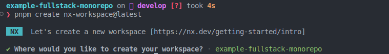
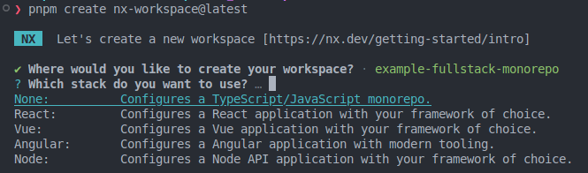
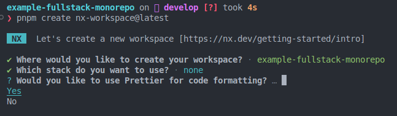
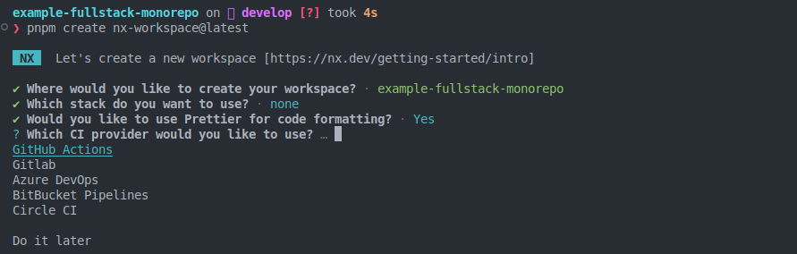
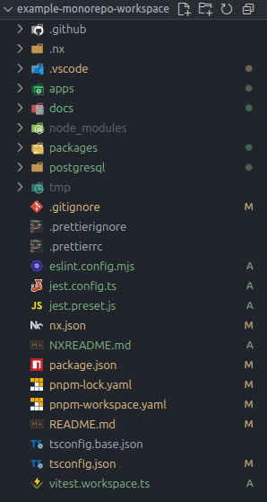
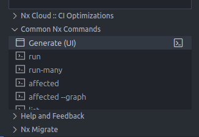
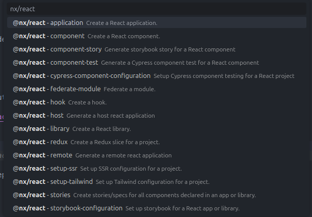
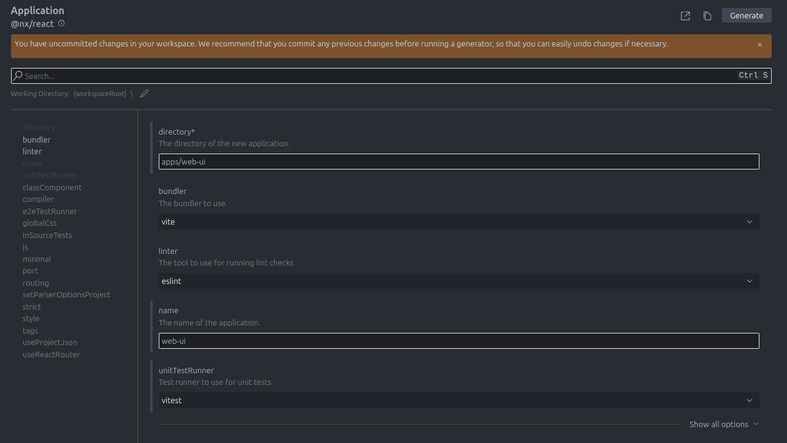
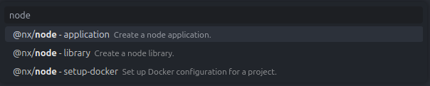
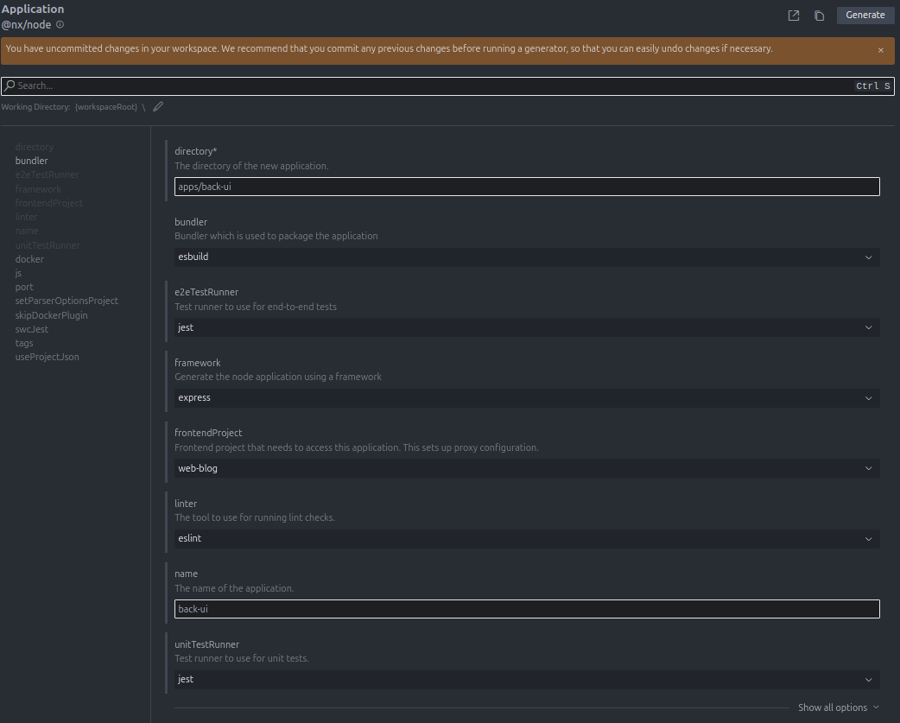

# 🚀 Fullstack Monorepo con pnpm + Nx

Este repositorio es una guía práctica para crear un monorepo moderno utilizando pnpm workspaces y Nx.
El objetivo es mostrar cómo estructurar, organizar, cachear y optimizar un workspace fullstack con React y NodeJs, incluyendo aplicaciones y librerías compartidas.

## 📚 Stack Tecnológico

Frontend: React + Vite

Backend: NodeJs

Base de datos: Postgres

Gestor de paquetes: pnpm

Orquestación y cacheo: Nx

## 🚀 Levantar el proyecto

Antes de iniciar cualquiera de las apps, asegurate de instalar todas las dependencias del monorepo:

```bash
pnpm install
```

Iniciar el servidor de desarrollo (React):

```bash
pnpm web:serve
```

⚙️ Levantar el backend (NodeJs)

Inicia el servidor de desarrollo:

```bash
pnpm back:dev
```

🗄️ Base de datos (Postgres)

Este proyecto utiliza Postgres como base de datos.

Debe iniciar el contenedor de postgres con docker:

```bash
cd postgresql
```

```bash
docker-compose up -d
```

## Generar el workspace

1. 🧱 Creación del Workspace

Vamos a generar un monorepo vacío utilizando Nx como base.

Ejecuta:

```bash
pnpm create nx-workspace@latest
```

2. Selecciona la ubicación del proyecto



3. Selecciona el stack None:



Luego instalaremos lo necesario manualmente.

4. ¿Deseas usar Prettier? yo siempre lo utilizo asi que lo acepto



5. Proveedor de CI

Yo utilizo GitHub Actions.



Al finalizar verás algo así:



## 🧩 ¿Qué hace que esto sea un monorepo?

El corazón del monorepo con pnpm es el archivo:

`pnpm-workspace.yaml`

```yaml
packages:
  - 'packages/*'

autoInstallPeers: true
```

Esto indica que todo lo que esté en packages es un subpaquete.
Para este proyecto agregamos también aplicaciones:

```yaml
packages:
  - 'apps/*'
  - 'packages/*'

autoInstallPeers: true
```

> 👉 pnpm workspaces crea el monorepo; Nx lo acelera, lo organiza y lo hace más productivo.

## ¿Por qué usar NX?

Si solo usás pnpm, notarás que las builds de librerías o herramientas internas se ejecutan cada vez, incluso si no tuvieron cambios.

Con Nx podés:

✔ Cachear builds y scripts

Solo se ejecutan si el proyecto o sus dependencias cambiaron.

✔ Tener un DAG (grafo de dependencias)

Perfecto para entender cómo se relacionan apps y libs.

✔ Controlar targets

Como build, test, lint, y sus dependencias.

✔ Acelerar la productividad del monorepo

### Configuración inicial de Nx

Nx genera un nx.json muy completo por defecto. Para este proyecto usaremos una versión minimalista:

```json
{
  "$schema": "./node_modules/nx/schemas/nx-schema.json",
  "sync": {
    "applyChanges": false
  },
  "namedInputs": {
    "default": ["{projectRoot}/**/*", "sharedGlobals"],
    "production": [
      "default",
      "!{projectRoot}/.eslintrc.json",
      "!{projectRoot}/eslint.config.mjs",
      "!{projectRoot}/**/?(*.)+(spec|test).[jt]s?(x)?(.snap)",
      "!{projectRoot}/tsconfig.spec.json",
      "!{projectRoot}/src/test-setup.[jt]s",
      "!{projectRoot}/jest.config.[jt]s",
      "!{projectRoot}/test-setup.[jt]s"
    ],
    "sharedGlobals": ["{workspaceRoot}/.github/workflows/ci.yml"]
  },
  "plugins": [
    {
      "plugin": "@nx/js/typescript",
      "options": {
        "typecheck": {
          "targetName": "typecheck"
        },
        "build": {
          "targetName": "build",
          "configName": "tsconfig.lib.json",
          "buildDepsName": "build-deps",
          "watchDepsName": "watch-deps"
        }
      }
    }
  ],
  "targetDefaults": {
    "test": {
      "dependsOn": ["^build"]
    },
    "serve": {
      "dependsOn": ["^build"]
    },
    "build": {
      "dependsOn": ["^build"],
      "cache": true
    }
  }
}
```

Esto indica que:

Cuando corremos serve, build, test, se construyen sus dependencias (^build).

Nx cachea los resultados de la build.

## 🖥️ Agregar una aplicación React

Empecemos instalando el plugin de Vite:

```bash
pnpm nx add @nx/vite
```

Y continuamos con el plugin de React:

```bash
pnpm nx add @nx/react
```

Para el siguiente paso debe utilizar la extensión de vscode para NX y utilizaremos el Generate UI



para buscar el @nx/react:app



Y completamos el formulario



Ya solo queda darle al botón de "Generate", para cuando finalice ejecutamos:

```bash
pnpm install
```

Agregamos los comandos centralizados en el package.json del root:

```json
{
  "scripts": {
    "web:serve": "nx serve web-blog",
    "web:build": "nx build web-blog",
    "web:lint": "nx lint web-blog",
    "web:test": "nx test web-blog",
    "web:playwright": "nx playwright web-blog"
  }
}
```

## 🛠️ Agregar una aplicación NodeJS

Instala el plugin de NodeJS:

```bash
pnpm nx add @nx/node
```

Volvemos a utilizar el Generate UI de NX para buscar el plugin de @nx/node:app



Y completamos el formulario



Y finalmente agregamos las dependencias:

```bash
pnpm install
```

Agregamos scripts al root:

```json
{
  "scripts": {
    "back:serve": "nx serve back-blog",
    "back:build": "nx build back-blog",
    "back:lint": "nx lint back-blog",
    "back:test": "nx test back-blog",
    "back:playwright": "nx playwright back-blog",
    "back-e2e:e2e": "nx e2e back-blog-e2e"
  }
}
```

## 📦 Creación de librerías internas (UI + Domain)

En un monorepo es común tener:

packages/ui-kit

Componentes de React reutilizables entre apps.

packages/domain

Interfaces, DTOs y validaciones compartidas por el backend y el frontend.

Para crear las librerias tiene muchas alternativas, pero yo utilizo tsub, puede utilizar la de su elección.

## 🗂️ Estructura final del monorepo

```txt
root
├── .github
|    └── workflows
|        └── ci.yml
├── .vscode
|    ├── extensions.json
|    └── settings.json
├── apps
│   ├── web-blog
│   ├── web-blog-e2e
│   ├── back-blog
│   └── back-blog-e2e
├── packages
│   ├── ui-kit
│   └── domain
├── postgresql
│   └── docker-compose.yml
├── node_modules
├── .prettierignore
├── .prettierrc
├── eslint.config.js
├── jest.config.ts
├── jest.preset.js
├── nx.json
├── package.json
├── pnpm-lock.yaml
├── pnpm-workspace.yaml
├── tsconfig.base.json
├── tsconfig.json
└── vitest.workspace.ts
```

## 🧪 Comandos útiles de Nx

```bash
# Ejecutar todas las builds
pnpm nx run-many --target=build --all
```

```bash
# Limpiar la cache
pnpm nx reset
```

```bash
# Ver el grafo de dependencias (muy recomendado)
pnpm nx graph
```

## 🧠 Consejos finales

- Mantené las dependencias compartidas en el root para evitar duplicados.
- Usá librerías en packages/ para maximizar el ahorro de tiempo con Nx.
- Nx es incremental: todo lo que no cambió, no se vuelve a ejecutar.
- Cada app debe tener su propio tsconfig, eslint.config.js y scripts mínimos.
